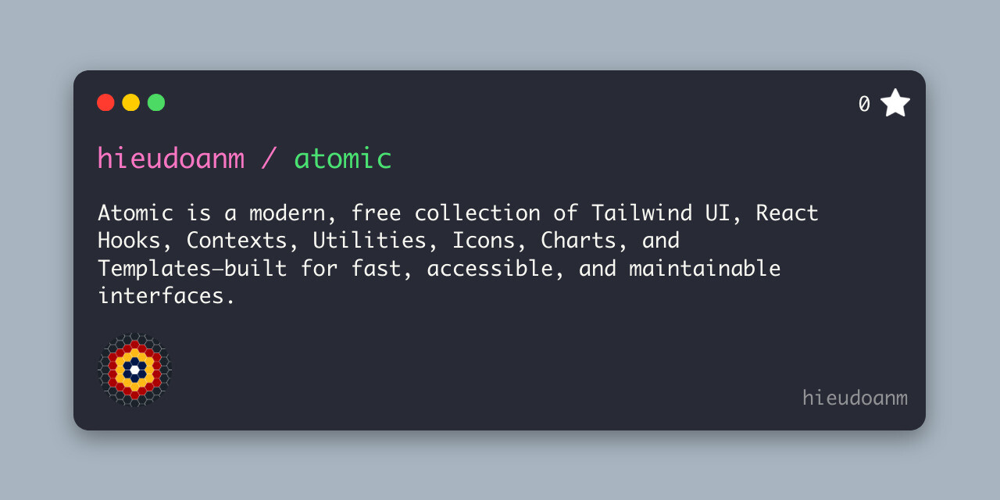

# [`atomic`](https://hieudoanm.github.io/atomic/)

## Table of Contents

- [`atomic`](#atomic)
  - [Table of Contents](#table-of-contents)
  - [Introduction](#introduction)
  - [Code](#code)
    - [React Hooks](#react-hooks)
    - [UI Components](#ui-components)
    - [Inspired By](#inspired-by)
  - [Themes / Preview](#themes--preview)
    - [Dark](#dark)
    - [Light](#light)
  - [Roadmap](#roadmap)
  - [Contributing](#contributing)
  - [License](#license)

## Introduction

`atomic` is a free, modern collection of Tailwind CSS UI components and reusable React Hooks, built with atomic design principles. It includes 44+ customizable components and practical hooks with built-in dark mode and responsive behavior—helping you build fast, accessible, and maintainable interfaces with ease.

`atomic/hooks` is a free collection of React hooks built with simplicity and reusability in mind. It offers a flexible set of essential utilities to help you manage state, side effects, and async logic more effectively — all with a focus on clean, scalable React code.

`atomic/ui` is a free collection of Tailwind CSS components designed with atomic design principles in mind. It offers a flexible set of 44 free, customizable components with built-in dark mode support to help you quickly build modern, responsive UI.

Browse the website for the components/hooks you need, copy the code and paste it into your project.

## Code

Status: `In Progress` - `Completed`

### React Hooks

`atomic/hooks` offer 16 components for free.

| No  | Group No | Group Name | Hook                  | Status    |
| --- | -------- | ---------- | --------------------- | --------- |
| 01  | 1.1      | Boolean    | `use-boolean`         | Completed |
| 02  | 1.2      | Boolean    | `use-toggle`          | Completed |
| 03  | 2.1      | Events     | `use-keyboard`        | Completed |
| 04  | 2.2      | Events     | `use-online`          | Completed |
| 05  | 2.3      | Events     | `use-resize`          | Completed |
| 06  | 2.4      | Events     | `use-scroll`          | Completed |
| 07  | 3.1      | Info       | `use-battery`         | Completed |
| 08  | 3.2      | Info       | `use-browser`         | Completed |
| 09  | 3.3      | Info       | `use-language`        | Completed |
| 10  | 3.4      | Info       | `use-screen`          | Completed |
| 11  | 4.1      | Navigator  | `use-clipboard`       | Completed |
| 12  | 4.2      | Navigator  | `use-geolocation`     | Completed |
| 13  | 5.1      | Storage    | `use-local-storage`   | Completed |
| 14  | 5.2      | Storage    | `use-session-storage` | Completed |
| 15  | 6.1      | Time       | `use-timeout`         | Completed |
| 16  | 6.2      | Time       | `use-interval`        | Completed |

### UI Components

`atomic/ui` offer 44 components for free.

| No  | Group No | Group Name | Component         | Status      |
| --- | -------- | ---------- | ----------------- | ----------- |
| 01  | 1.01     | Button     | Button            | Completed   |
| 02  | 1.02     | Button     | Button Group      | Completed   |
| 03  | 1.03     | Button     | Button - Dropdown | In Progress |
| 04  | 1.04     | Button     | Icon Button       | In Progress |
| 05  | 2.01     | Data       | List              | Completed   |
| 06  | 2.02     | Data       | Stats             | Completed   |
| 07  | 2.03     | Data       | Table             | Completed   |
| 08  | 2.04     | Data       | Tooltip           | Completed   |
| 09  | 2.05     | Feedback   | Alert             | Completed   |
| 10  | 2.06     | Feedback   | Badge             | Completed   |
| 11  | 2.07     | Feedback   | Loading           | Completed   |
| 12  | 2.08     | Feedback   | Progress          | Completed   |
| 13  | 2.09     | Feedback   | Skeleton          | Completed   |
| 14  | 2.10     | Feedback   | Toast             | Completed   |
| 15  | 3.01     | Form       | Calendar          | Completed   |
| 16  | 3.02     | Form       | Checkbox          | Completed   |
| 17  | 3.03     | Form       | Input             | Completed   |
| 18  | 3.04     | Form       | Radio             | Completed   |
| 19  | 3.05     | Form       | Range             | Completed   |
| 20  | 3.06     | Form       | Select            | Completed   |
| 21  | 3.07     | Form       | Textarea          | Completed   |
| 22  | 3.08     | Form       | Toggle            | Completed   |
| 23  | 4.01     | Layout     | Accordian         | Completed   |
| 24  | 4.02     | Layout     | Card              | Completed   |
| 25  | 4.03     | Layout     | Collapse          | Completed   |
| 26  | 4.04     | Layout     | Divider           | Completed   |
| 27  | 4.05     | Layout     | Drawer            | In Progress |
| 28  | 4.06     | Layout     | Footer            | Completed   |
| 29  | 4.07     | Layout     | Hero              | Completed   |
| 30  | 4.08     | Layout     | Modal             | Completed   |
| 31  | 5.01     | Media      | Avatar            | Completed   |
| 32  | 5.02     | Media      | Carousel          | In Progress |
| 33  | 5.03     | Media      | Diff              | In Progress |
| 34  | 5.04     | Media      | File              | Completed   |
| 35  | 6.01     | Navigation | Breadcrumbs       | Completed   |
| 36  | 6.02     | Navigation | Menu              | Completed   |
| 37  | 6.03     | Navigation | Navbar            | Completed   |
| 38  | 6.04     | Navigation | Pagination        | Completed   |
| 39  | 6.05     | Navigation | Steps             | Completed   |
| 40  | 6.06     | Navigation | Tabs              | In Progress |
| 41  | 7.01     | Typography | Code              | Completed   |
| 42  | 7.02     | Typography | KBD (Keyboard)    | Completed   |
| 43  | 7.03     | Typography | Heading           | Completed   |
| 44  | 7.04     | Typography | Text              | Completed   |

### Inspired By

- React Hooks
  - [useHooks](https://usehooks.com/)
  - [useHooksTS](https://usehooks-ts.com/)
- UI Components
  - CSS Utilities
    - [DaisyUI](https://daisyui.com/)
    - [Flowbite](https://flowbite.com)
    - [HyperUI](https://www.hyperui.dev/)
    - [MerakiUI](https://merakiui.com/)
    - [Tailwind UI](https://tailwindui.com/)
  - React
    - [Ant Design](https://ant.design/)
    - [Chakra UI](https://chakra-ui.com/)
    - [Headless UI](https://headlessui.com/)
    - [Hero UI](https://www.heroui.com/)
    - [Material UI](https://mui.com/)
    - [Radix UI](https://www.radix-ui.com/)
    - [shadcn/ui](https://ui.shadcn.com/)

## Themes / Preview

### Dark

### Light

## Roadmap

- [ ] Add more Components from 38 to 44
- [ ] Add Comments

## Contributing

You can create a new branch and submit your changes in a PR. Please note that all PRs need to be reviewed.

## License

`atomic/ui` is an open source project licensed under the [GPL-3.0](./LICENSE) license.
